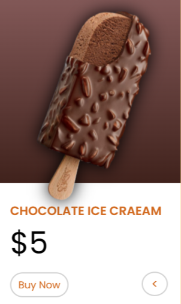

<h1>Description</h1>

A simple rotating card made with html, css and javaScript

<h1>Resources</h1>

<link href="https://www.w3schools.com/howto/howto_css_flip_card.asp">Click here to know to rotate card

<h1>Screenshots</h1>
<table>
<tr>
    <td></td>
    <td></td>
</tr>

</table>
<h1>Video Preview</h1>
<table>
<tr>
    <td>
        
    </td>
</tr>

</table>